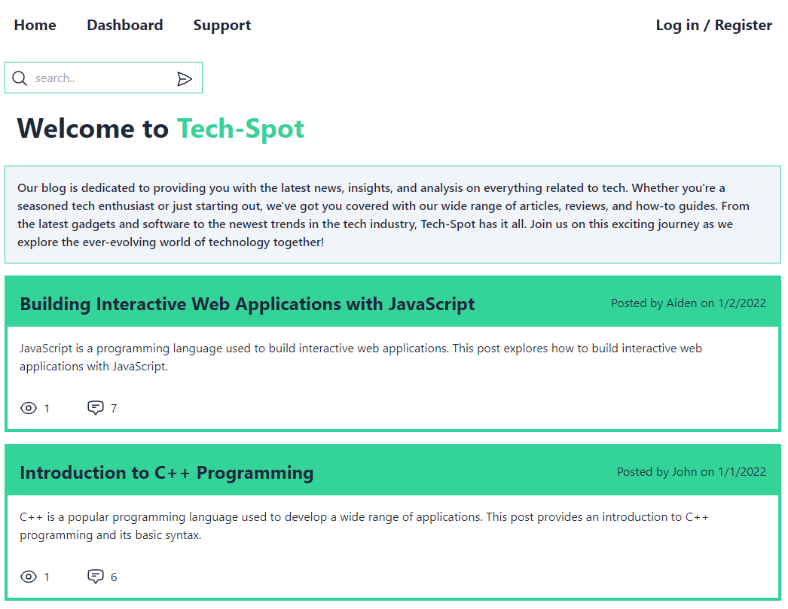
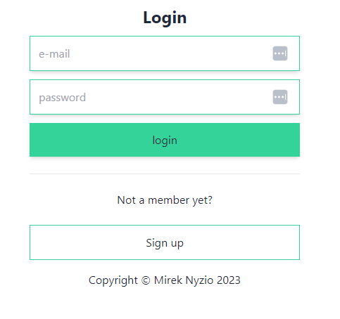
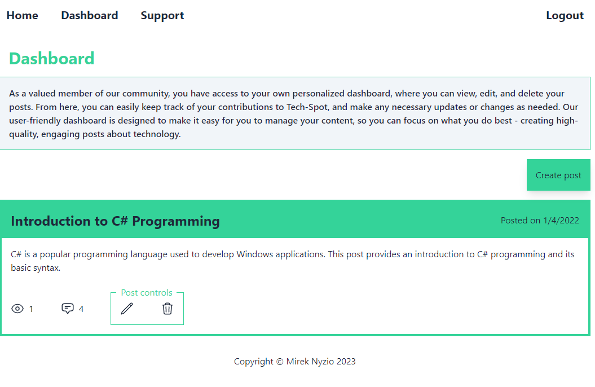
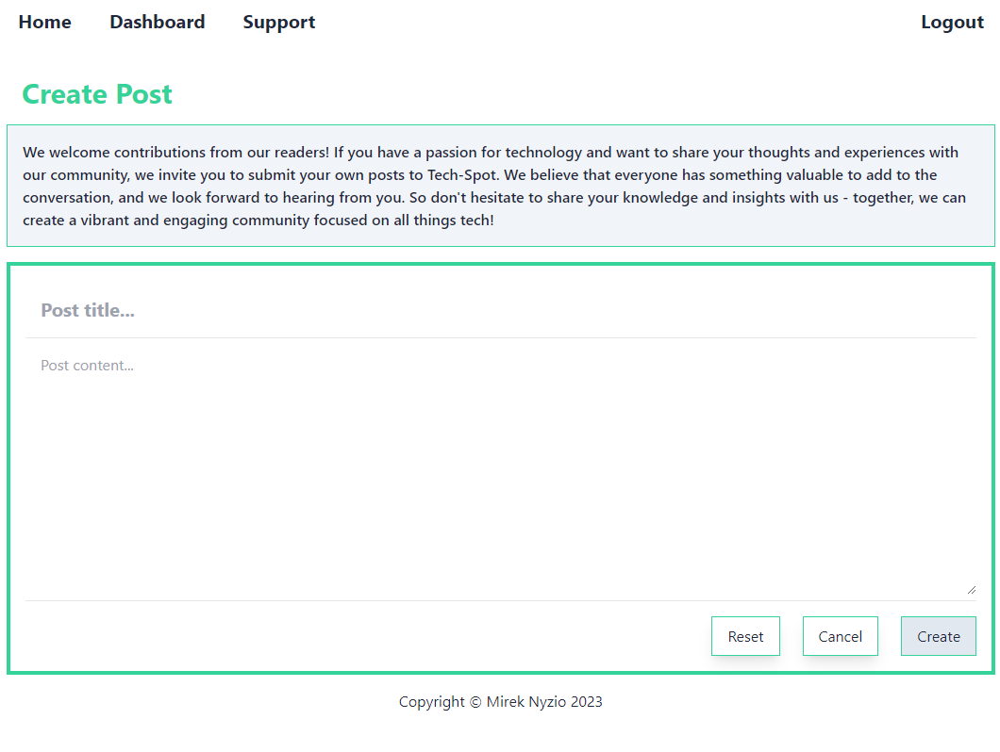
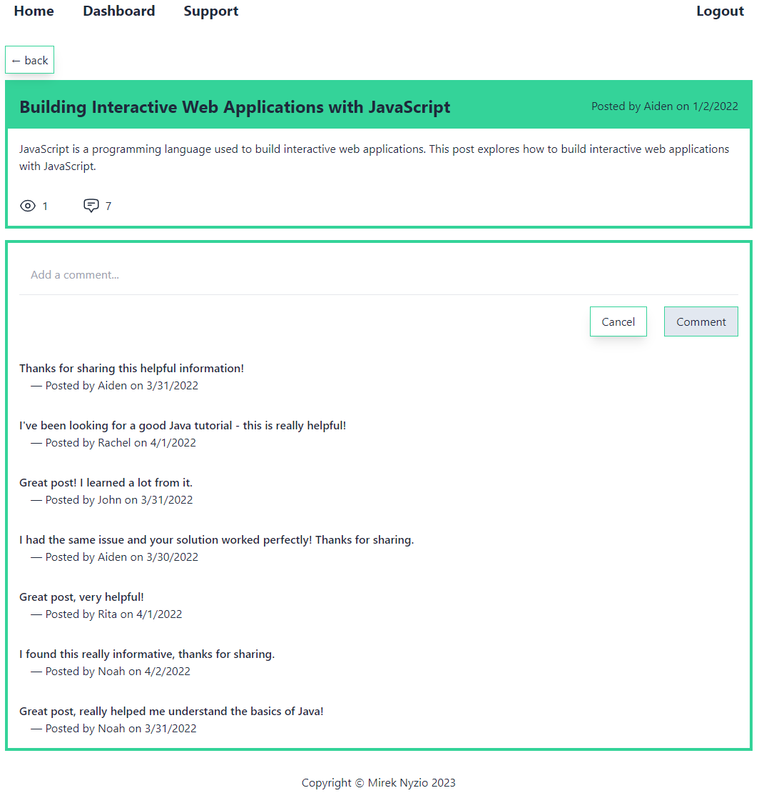
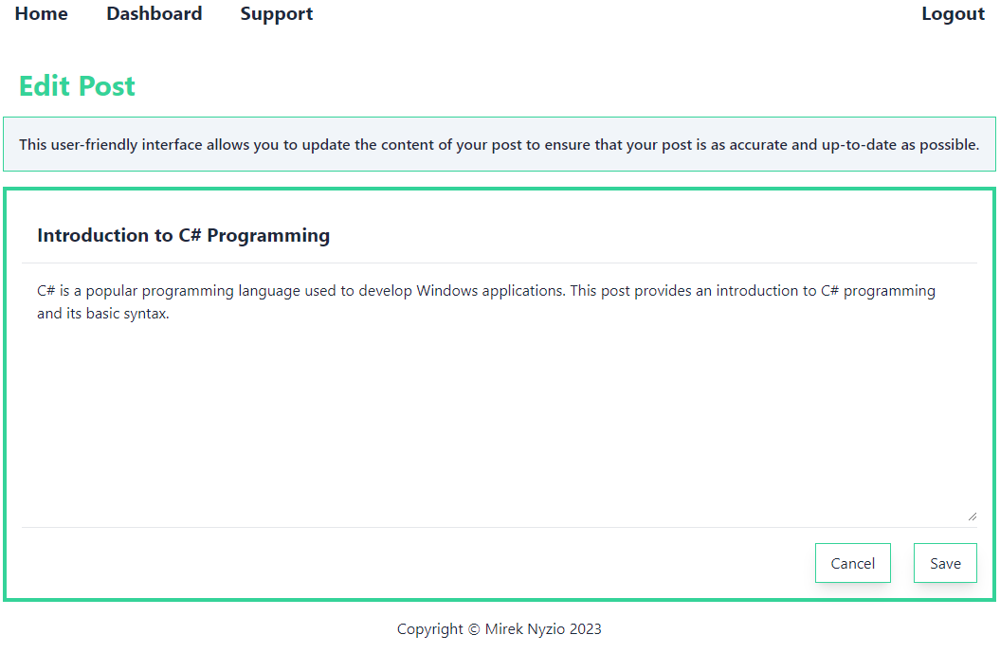

# TECH-SPOT 

## Description
CMS style Technology Blog which allows users to share their passion for tech by creating posts 
that other users can comment on as well as adding comments on other users posts.

In addition to being able to create a post users have the ability to edit or delete 
the posts they created, see how many times each post has been viewed by unique users 
and see a current count of how many comments were added to each post.

Tech-spot follows MVC paradigm in its architectual structure, using Handlebars.js as 
the templating language, Sequelize as the ORM, and the express-session npm package 
for authentication.

App is fully responsive uses API Routes to perform RESTful CRUD operations.

- [TECH-SPOT](#tech-spot)
  - [Description](#description)
  - [Installation](#installation)
      - [Link to GitHub Repo](#link-to-github-repo)
      - [Link to deployed blog](#link-to-deployed-blog)
  - [Usage](#usage)
  - [Contributors](#contributors)
  - [License:](#license)
      - [MIT License](#mit-license)
  - [Dev](#dev)
      - [Languages and packages used](#languages-and-packages-used)
      - [mySQL initial setup](#mysql-initial-setup)
      - [mySQL Seed](#mysql-seed)
  - [Questions and support](#questions-and-support)
      - [GitHub](#github)
      - [e-mail](#e-mail)
  - [Mock-up](#mock-up)
      - [Homepage](#homepage)
      - [Homepage mobile](#homepage-mobile)
      - [Login / Signup](#login--signup)
      - [Dashboard](#dashboard)
      - [Crate post](#crate-post)
      - [View post](#view-post)
      - [Edit post](#edit-post)

## Installation 

This app runs in web browser.

#### Link to GitHub Repo

[https://github.com/mnyzio/tech-spot](https://github.com/mnyzio/tech-spot)

#### Link to deployed blog

[https://techspot.herokuapp.com](https://techspot.herokuapp.com)

## Usage

Users without an account can view hompepage and support pages as well as use search functionality.
Users will need to logged in to:
- view posts,
- comment on posts,
- view dashboard
- edit their posts
- delete their posts
- 
## Contributors

Mirek Nyzio
[www.github.com/mnyzio](www.github.com/mnyzio)

## License:

#### MIT License

## Dev 
#### Languages and packages used
- ORM - Object-Relational-Mapping 
- mySQL 
- Sequelize
- mySQL 
- session
- Express 
- Node.js
- Handlebars.js
- HTML
- CSS (Tailwind)
  
#### mySQL initial setup
For application to be able to run database needs to be created using 'schema.sql' file located in 'db' folder.

#### mySQL Seed
Database can be seeded using "node seeds/see.js" command

## Questions and support

#### GitHub
[www.github.com/mnyzio](www.github.com/mnyzio)

#### e-mail
[m.nyzio@outlook.com](m.nyzio@outlook.com)

## Mock-up

#### Homepage

#### Homepage mobile

#### Login / Signup 

#### Dashboard

#### Crate post

#### View post

#### Edit post
